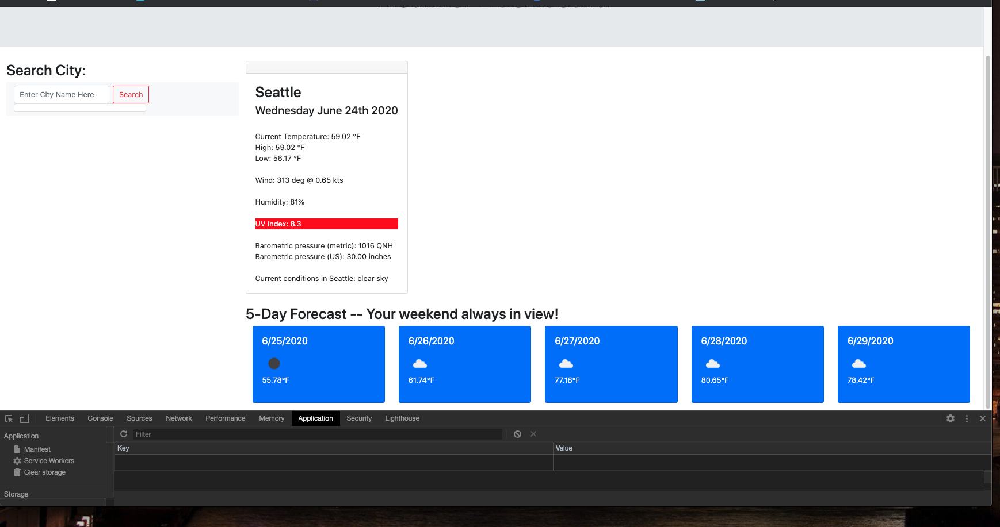
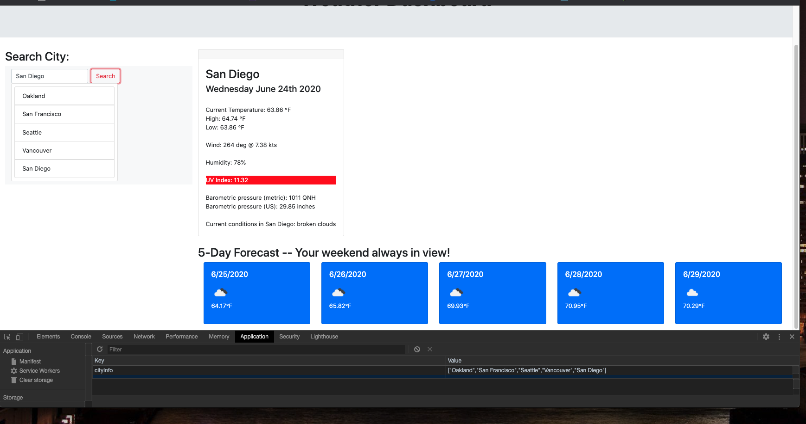

# Homework 6 Description

Github URL: https://mlshenk.github.io/homework-6/index.html

This assignment was to create a functional weather app displaying current time (done using moment.js), current weather conditions, a five day forecast, and a list of recently searched cities (using the local storage function). When the user first opens the page, the browser will display current Seattle weather conditions by default. The user may input a city in the left searchbar to view the weather in that city. The search will engage the OpenWeather API in order pull the data for the city entered in the searchbar. I used an ajax funtion to retrieve the first set of data for that new city and pulled the data for future weather forecast information. The geographical coordinates of that location is then logged under a variable for use in another ajax function nested under the parent function, necessary for retrieving the UV index and other weather information. I added some bonus data in order to create a more complete weather report, with temperature ranges, wind direction, barometric pressure (in both QNH and millibar units!), and current conditions. I was also tasked to display the UV risk levels (green, yellow, and red, respectively) by using conditionals. The colors would change as the UV index increased. I used a loop to render the 5-day forecast below the weather report to complete the weather related requirements. Another major component of this assignment was to store user location input using local storage and display it below the searchbar on the left of the screen. The search bar displays the five most recently searched locations and will allow the user to return to those weather reports by clicking on the button in the field to the left. It was challenging, but I was able to prevent the list from appending duplicate user inputs to the page. 

